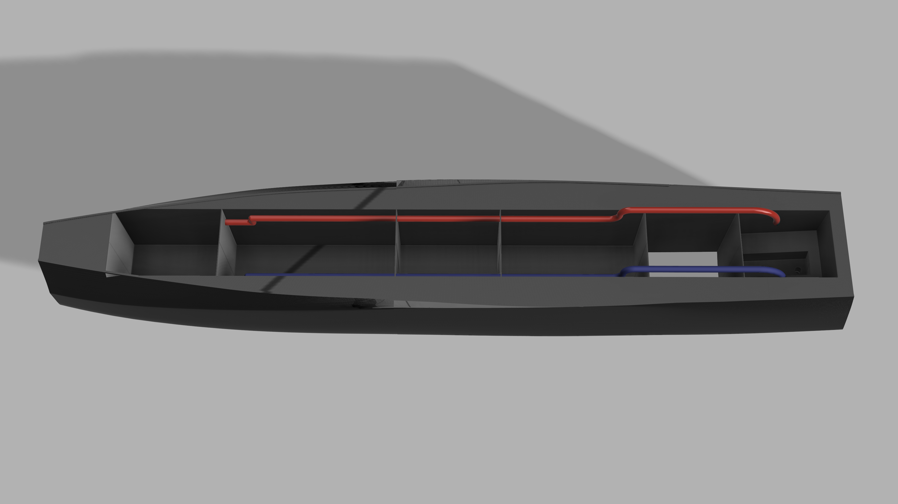
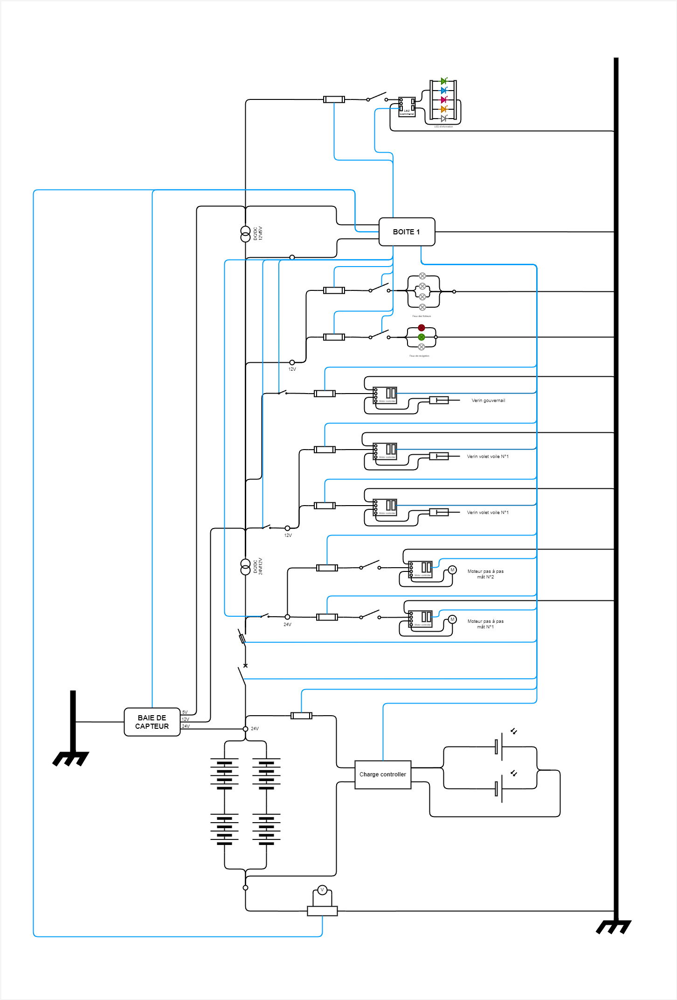
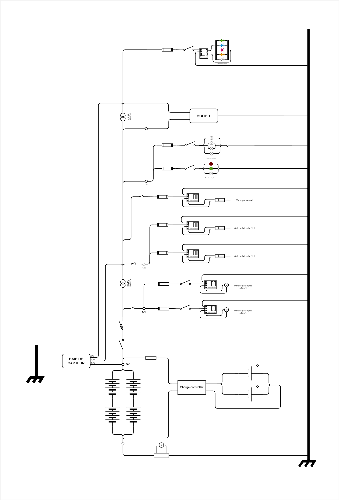
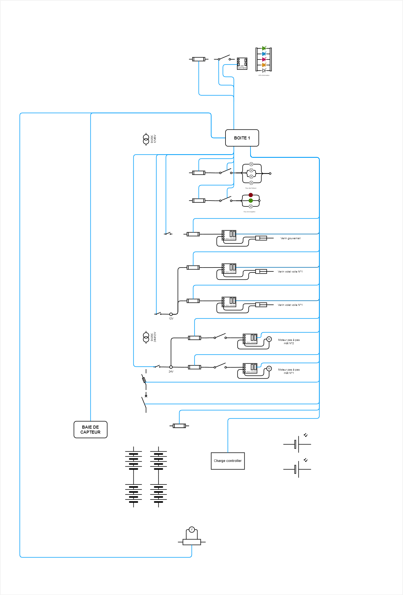

# Électricité

Pour alimenter les équipements externes des boites, une interface de connexion dédiée sera installée. Elle fournira les tensions nécessaires : **5V**, **12V**, et **24V**.

Le bateau est alimenté en électricité par **deux panneaux solaires de 300 W**.

```tip
Il serait utile de vérifier si de nouveaux panneaux plus performants sont disponibles, car ceux-ci ont été choisis le *30/07/2023*.
```  

Deux faisceaux de câbles sont prévus :  
1. **Un faisceau pour les câbles de puissance**, qui alimente les différents équipements.  
2. **Un faisceau pour les câbles d'information**, qui transmet les données ou les ordres entre les équipements.

Pour éviter la déformation des signaux par les champs électromagnétiques des câbles de puissance, ces deux faisceaux seront séparés de chaque côté des boîtes (Cf rendu provisoire ci-dessous).  

  

- **Faisceau de puissance** (représenté en rouge) : Ce faisceau regroupe tous les câbles qui alimentent les équipements sans autre fonction que l'alimentation électrique.
  
- **Faisceau d'information** (représenté en bleu) : Ce faisceau regroupe les câbles qui transmettent des informations aux équipements. Cela inclut par exemple les données de la baie de capteurs envoyées au PC ou les directives données par le PC pour commander des vérins, moteurs ou autres composants.

Pour éviter les interférences et le bruit dans les signaux, notamment pour ceux qui nécessitent une grande précision, certains câbles d'information devront être blindés, bien que cela entraîne un coût supplémentaire.

Les faisceaux électriques sont des tubes en **PVC**, dotés de raccords en **T** pour diriger les câbles vers les bonnes boîtes. Ils seront installés aussi haut que possible pour éviter que l'eau ne pénètre à l'intérieur en cas d'avarie.

De plus, la baie de capteurs est alimentée par le haut de chaque côté par des **flexibles étanches** : un pour l'information et un pour la puissance, comme décrit dans l'[arrangement](BaieDeCapteur#arrangement) de la baie de capteurs. C'est pourquoi les faisceaux seront installés à l'extérieur.

Dans la **boîte n°3**, il est prévu d'installer le **contrôleur de charge** ainsi que le **boîtier à fusibles**. Les deux seront montés sur des rails verticaux à l'intérieur de la boîte, afin de faciliter leur manipulation et entretien.


# Cahiers des charges

## Cahier des charges - Autonomie énergétique

| Fonction | Critère | Niveau | Flexibilité |
| ----- | ----- | ----- | ----- |
| Autonomie en mode normal sans source de puissance apportée | Temps d'utilisation | 72 h | - 6 h |
| Autonomie en mode dégradé sans source de puissance apportée | Temps d'utilisation | 7 jours | - 1/2 jour |
| Avoir une batterie de secours pour envoyer des signaux de détresse* | Temps d'utilisation | 7 jours | / |
| Respect du budget | Prix | < 2500 € | 1000 € |
| Fiabilité, robustesse et durabilité | Matériaux et équipement résistant dans le temps | / | / |
| Les batteries doivent pouvoir rentrer dans les boîtes | / | / | / |
| Les panneaux solaires doivent loger sur les bras des flotteurs | Dimensions : 125x110 cm | / | / |
| Les panneaux solaires doivent résister au milieu marin | Durabilité | Excellente | / |
| Être capable de charger les batteries en plus d'alimenter le système lors de conditions normales | Ratio $\frac{Production}{Consommation}$ | > 1 | / |

*Consommation inférieure à 1 Wh avec déclenchement automatique en cas d'avarie majeure. 


# Schéma électrique

> [!WARNING]
> Le schéma électrique est à compléter. Il ne représente pas toutes les connexions à ce jour !

## Esquisse du schéma électrique du Zéphyr

### Complet

Représente les connexions des différents éléments du Zéphyr  



### Puissance
Représente les connexions pour transmettre du courant aux éléments du Zéphyr  



### Information
Représente les connexions pour transmettre de l'information aux éléments du Zéphyr  



