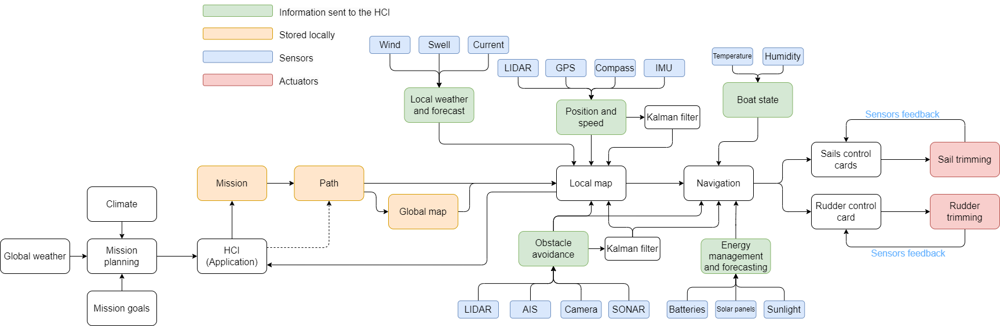
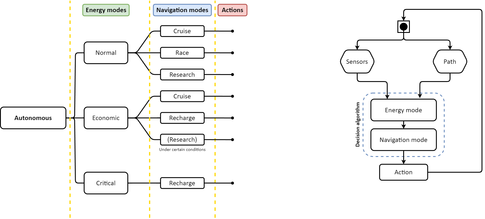

# Architecture système du Zéphyr

Cette section décrit l'architecture de commande du voilier **Zéphyr** dans ses différents modes. Elle est inspirée de l'architecture de l'[AutoNaut](https://autonaut.itk.ntnu.no/doku.php?id=start).

Nous avons défini trois niveaux, similaires à ceux utilisés en programmation, du plus proche au plus éloigné du hardware :

- **Hardware et contrôle global**
- **Navigation, mission et contrôle**
- **Capteurs et sondes, science**

---

## 1. Hardware et contrôle global

À ce niveau, on trouve les équipements qui permettent la communication entre l'opérateur et le Zéphyr, ainsi que ceux nécessaires pour faire avancer le bateau. Ce niveau inclut :

- **Iridium** : Module de communication par satellite pour les échanges à longue distance.
- **Communication LoRa** : Système de communication radio longue portée.
- **Panneaux photovoltaïques et batteries** : Source d'énergie pour alimenter les équipements du bateau.
- **Moteurs et vérins** : Équipements mécaniques permettant de manœuvrer le bateau.

---

## 2. Navigation, mission et contrôle

Ce niveau comprend les algorithmes de prise de décision du bateau, ainsi que les capteurs permettant de comprendre l'environnement extérieur. Ce niveau inclut :

- **GPS** : Système de positionnement pour déterminer la localisation du bateau.
- **Station météo** : Capteurs environnementaux pour mesurer la température, la pression, l'humidité, etc.
- **Caméras** : Capteurs visuels pour capturer des images ou vidéos de l'environnement.
- **Lidar** : Capteur de détection et de mesure de distance par laser.
- **Sonar** : Capteur permettant la détection sous-marine et la mesure de la profondeur.
- **Centrale inertielle** : Système de détection des mouvements du bateau (accélération, orientation).
- **Modem Milesight UR35** : Modem de communication WiFi et 4G pour la connectivité.
- **AIS (Automatic Identification System)** : Système permettant de détecter les navires à proximité et de recevoir leur position.
- **Iridium** : Communication par satellite pour garantir une couverture globale.
- **Communication LoRa** : Communication longue portée entre le Zéphyr et les stations au sol.

## 3. Capteurs et sondes scientifiques

Ce niveau regroupe tous les équipements scientifiques embarqués sur le Zéphyr pour compléter ses missions de collecte de données. Ce niveau est flexible et peut être modifié ou enrichi en fonction des objectifs scientifiques spécifiques définis pour chaque mission. 

Les capteurs et sondes incluent :

- **Sondes de température et d'humidité** : Pour mesurer les conditions environnementales, à la fois au-dessus et en dessous de l'eau.
- **Caméras sous-marines et capteurs d'images** : Pour l'observation et l'étude des fonds marins et des espèces aquatiques.
- **Sonar** : Pour mesurer la profondeur et détecter des objets sous l'eau.
- **Lidar sous-marin** : Pour créer des cartes détaillées du fond marin.
- **Capteurs chimiques** : Pour mesurer la qualité de l'eau, notamment la salinité, le pH, ou d'autres paramètres chimiques.
- **Accéléromètres et capteurs inertiels** : Pour mesurer les mouvements du Zéphyr et ses interactions avec l'environnement.

### Gestion des données

Étant donné la quantité potentiellement importante de données générées par ces capteurs, le Zéphyr pourrait nécessiter un **ordinateur de bord supplémentaire** pour gérer ces flux de données. Cela inclurait la gestion en temps réel des capteurs, ainsi que le stockage et le traitement des données.  

Une **baie de stockage d'information** pourrait être ajoutée pour conserver les **logs des capteurs**, assurant ainsi la traçabilité des mesures et permettant de récupérer les données après chaque mission.

### Recommandations supplémentaires

- **Gestion de l'énergie** : Un contrôle strict de la consommation énergétique des capteurs et des systèmes associés pourrait être mis en place pour garantir une utilisation optimale des ressources (panneaux solaires et batteries).
- **Redondance des systèmes** : Pour garantir la fiabilité des missions scientifiques, il pourrait être nécessaire de mettre en place des systèmes de redondance pour certains capteurs, en particulier ceux qui collectent des données critiques.

## Schéma

Schéma récapitulatif :

# Niveau 0

# Niveau 1

Nous choisirons, dans le cas du Zéphyr, un contrôleur de charge de type MPPT (Maximum Power Point Tracking). Ce type de régulateur permet de maximiser l'énergie extraite des panneaux solaires, même si les conditions varient. Il offre un très bon rendement (meilleur que celui d'un régulateur PWM) et permet d'augmenter la durée de vie des batteries ([Wikipédia](https://en.wikipedia.org/wiki/Maximum_power_point_tracking)).

Deux chiffres sont inscrits sur les contrôleurs de charge : le premier (150 dans notre cas) représente la tension à vide du parc de panneaux photovoltaïques, et le second, séparé par une barre (35 dans notre cas), correspond au courant maximal que le contrôleur peut transmettre aux batteries. Il est crucial que cette valeur soit inférieure à l'intensité maximale en charge des batteries.

Pour obtenir une estimation du dimensionnement du régulateur de charge, vous pouvez consulter directement le site de [Victron Energy](https://www.victronenergy.fr/mppt-calculator).

Dans notre cas, nous avons choisi le modèle **Victron Energy 150 | 35** ([lien](https://www.myshop-solaire.com/regulateur-solaire-mppt-150-35-12-24-36-48v-victron-energy-_r_688_i_12.html)). La tension à vide de notre parc de panneaux ne dépasse pas les 43,52 V pour deux panneaux de 300W en parallèle ([lien](https://www.seimi-equipements-marine.com/fr/electricite-marine/panneaux-solaires/panneaux-solaires-rigides/panneau-solaire-spectra-/pdt_9498)). Le système est surdimensionné de 40 %, d'après les calculs du dimensionnement réalisés par Victron Energy.

Le câblage du MPPT est détaillé à la page 13 du [manuel de montage](https://www.victronenergy.com/upload/documents/Manual_SmartSolar_MPPT_150-35__150-45/29694-MPPT_solar_charger_manual-pdf-en.pdf) de Victron Energy.

Concernant la conversion de la tension de 24V vers 12V, nous avons sélectionné un **convertisseur DC-DC 24V vers 12V** ([lien](https://www.myshop-solaire.com/victron-energy-chargeur-orion-tr-smart-isole-dc-dc-24v-12v-20a-240w--_r_804_idr_804_i_2767.html)).

Le choix du contrôleur de moteur à pas (stepper motor controller) est à déterminer pour compléter le niveau 1 de l'architecture.

# Niveau 2

## Liste des sorties d'information de l'ordinateur de bord

### Commandes
- **Commande du moteur pas à pas du mât n°1**
- **Commande du moteur pas à pas du mât n°2**
- **Commande du vérin du volet de la voile n°1**
- **Commande du vérin du volet de la voile n°2**
- **Commande du vérin du gouvernail**

### Informations environnementales
- **Centrale météo**
- **GPS**
- **Centrale inertielle**
- **Caméras**
- **LIDAR**
- **SONAR**
- **Capteur de température** (de toutes les boîtes)
- **Capteur hygrométrique** (de toutes les boîtes)

### Communications
- **Iridium**
- **AIS**
- **LoRa**
- **Milesight UR 35**

### Baie de capteur

## Navigation

**Schéma global de la planification de la navigation**

### Algorithmes

#### Schéma de decision du Zéphyr

#### Évitement d'obstacle