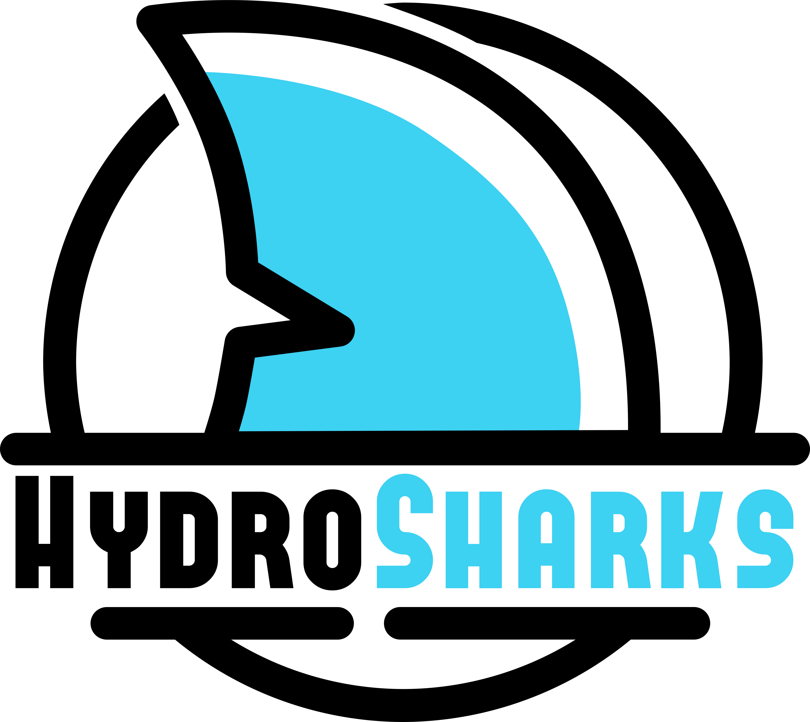

# Bienvenue sur le Wiki du projet Zéphyr !

    
Par l'association étudiante de construction navale de SeaTech

    

Le projet Zéphyr consiste en la conception et la construction d'un trimaran autonome de recherche scientifique propulsé par la seule force du vent. Constitué de deux voiles rigides, le Zéphyr, nom donné au trimaran, mesure en tout 4.7m par 3.2m pour 3.8m de haut. Entièrement démontable, du nez au safran en passant par les voiles, ce trimaran peut être transporté partout sans encombre. Ces deux voiles rigides constituées d'un plan principal et d'un volet lui permettent un meilleur captage du vent et une meilleure manœuvrabilité en toute circonstance. Son agencement et sa capacité d'être démontable lui procure aussi une grande polyvalence dans la réalisation des missions qui lui seront confiées. 

## Objectif de ce wiki : 
* Tenir à jour les avancés sur le projet ;
* Expliquer le fonctionnement du Zéphyr ;
* Avoir un historique des différentes actions menées et justifier ces choix.

## Structuration du Wiki

Chaque partie importante du Zéphyr sera documentée dans une page distincte.

Liste des pages du Wiki

<ul>
  <li><a href="Coque/README.md">Page Coque</a></li>
  <li><a href="Voile">Page voile</a></li>
  <li><a href="Electricite">Page Électricité</a></li>
  <li><a href="Equipement">Page équipement</a></li>
</ul>

