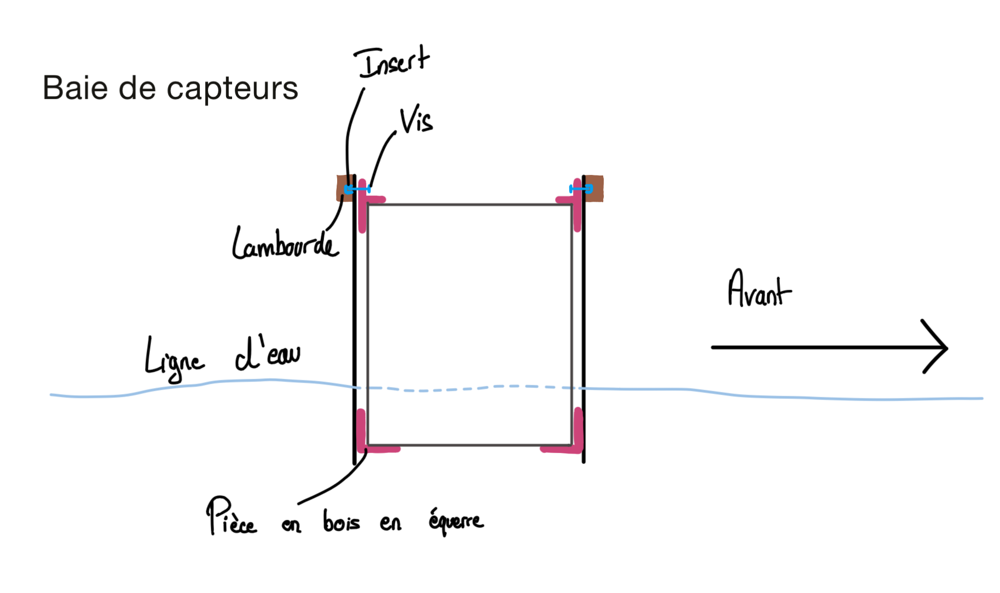

# Baie de capteur

La baie de capteur est un trou dans la structure du bateau permettant un accès direct à l'eau. Elle est positionnée entre la boite n°4 et la boite n°5. 
Cette baie sert à fixer les capteurs et sondes qui interagiront avec l'environnement marin pour collecter des données.  

Deux options sont possibles pour l'installation des capteurs :
1. Une boîte dans laquelle les sondes et capteurs sont en contact direct avec l'eau.
2. Un mât sur lequel sont fixés les différents capteurs.

```tip
Pour le moment, l'idée d'un mât semble la plus prometteuse car elle permet une plus grande facilité d'accès pour les différents laboratoires. De plus, un mât permet d'atteindre différentes profondeurs, offrant ainsi une meilleure flexibilité pour les mesures.
```

---

# Arrangement

L'acheminement de l'énergie vers les équipements se fait grâce à un **panneau d'alimentation** situé sur le dessus de la baie de capteurs. Il est également nécessaire de faire passer tous les câbles d'information provenant des capteurs. 

Afin de réduire le nombre de câbles et améliorer la gestion des connexions, l'utilisation d'un **bus CAN** ou d'un système similaire est recommandée. Ce type de bus permet de connecter plusieurs équipements tout en simplifiant l'installation et le câblage.

---

# Construction

### Mât

Le mât sera soutenu à **deux endroits** pour annuler les moments qu'il subit : un support en haut et un en bas.  
L'objectif est de concevoir un mât profilé qui subisse peu de résistance tout en étant extrêmement modulable. Il sera donc essentiel de prévoir plusieurs **points d'accroche** simples et nombreux sur le mât pour permettre une fixation flexible des capteurs.

### Boîte

La boîte de la baie de capteur sera fixée à l'aide de **languettes en L** à plusieurs points d'attache afin de garantir une fixation solide et fiable.

