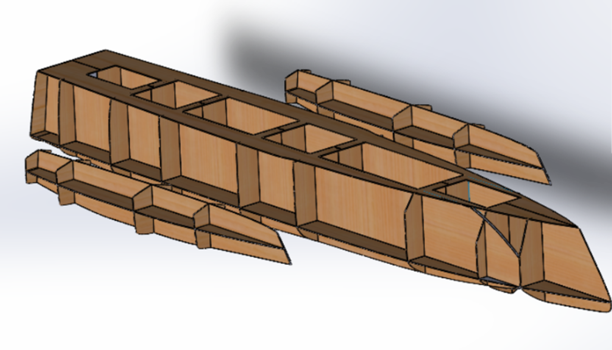
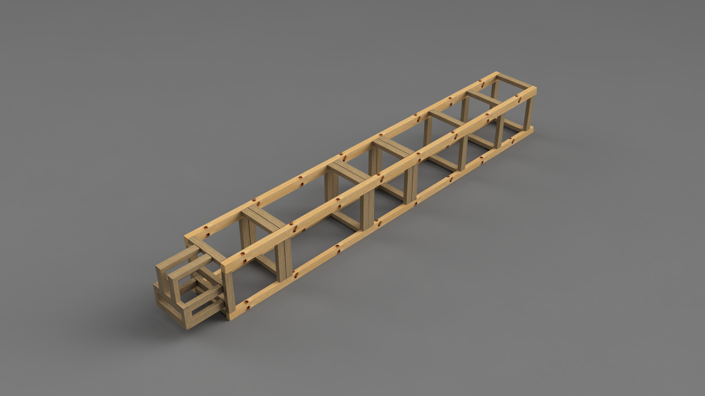

# Coque

La construction de la coque repose sur 4 parties principales :  
1. **Squelette** : réalisé en contreplaqué marine de 5 mm.  
2. **Armature** : constituée de chevrons.  
3. **Forme de la coque** : fabriquée en polystyrène.  
4. **Nez démontable** : pièce amovible fixée à l’avant sur l’armature.

### Assemblage
- **Squelette** : assemblage façon puzzle.  
- **Armature** : fixée avec des vis.  
- **Forme de la coque** : collée pour un maintien optimal.  
- **Nez démontable** : se fixe directement sur l’armature avant du bateau.

### Organisation interne
La coque est divisée en 5 compartiments vides, appelés *boites*, numérotées de **1** à **5**, chacune ayant une fonction spécifique :

| **Boite** | **Section** | **Description** |
|-----------|-------------|------------------|
| 1         | 3           | Matériel informatique et communication |
| 2         | 4           | Voile N°1 et batteries principales |
| 3         | 5           | Puits de dérive, contrôleur de charge et gestionnaire intelligent de la batterie |
| 4         | 6           | Voile N°2 et éventuellement des batteries (à confirmer) |
| 5         | 8           | Gouvernail et éventuellement des batteries (à confirmer) |

#### Étanchéité et connectiques
- La **boite N°1** est entièrement étanche et isolée des autres. Une boîte d’acquisition devra être conçue sur mesure pour gérer les connectiques et l’alimentation de ses composants.
- Les **boites N°2 à N°5** seront étanches uniquement à leur base. Elles sont reliées par des câbles d’alimentation électrique et d’information pour assurer le fonctionnement coordonné de tous les systèmes.  
  *(Pour plus de détails, voir [Page Électricité](../ArchitectureSysteme/Electricite))*

### Électricité
Pour alimenter les équipements externes des boites, une interface de connexion dédiée sera installée. Elle fournira les tensions nécessaires : **5V**, **12V**, et **24V**.

# Dimensions

## Coque
- **Longueur** : 4680 mm  
- **Hauteur** : 581 mm  
- **Largeur** : 692 mm  

## Flotteur
- **Longueur** : 2325 mm  
- **Hauteur** : 300 mm  
- **Hauteur avec brides** : 480 mm  
- **Largeur** : 300 mm  

## Dimensions générales minimales
- **Longueur** : 4.7 m  
- **Hauteur totale** : 3.8 m  
- **Largeur** : 3.3 m  

# Squelette

Le squelette comporte des encoches spécifiques sur chaque couple pour s’assembler correctement :

- Couple 2 : **102.5 mm**  
- Couple 3 : **145 mm**  
- Couple 4 : **155 mm**  
- Couple 5 : **160 mm**  
- Couple 6 : **160 mm**  
- Couple 7 : **150 mm**  
- Couple 8 : **140 mm**  



# Armature

L’armature se compose de chevrons de deux tailles distinctes :  
- **Chevron supérieur** : 50x75 mm, traité en classe 2.  
- **Chevron inférieur** : 38x63 mm ou 38x60 mm (dimensions approximatives).  

Ces chevrons traversent toute la longueur du bateau, de l’avant à l’arrière. Sur eux sont fixés :  
- **Hauteurs** : renforts verticaux.  
- **Traverses** : renforts horizontaux.  

À l’avant, un système spécifique permet de fixer le nez démontable du Zéphyr.



# Description plus précise de l'organisation des boites

## Boite N°1

Dans cette boîte, vous trouverez tous les équipements listés [ici](Equipement#liste-des-équipements-présents-dans-le-zéphyr) :

- **LattePanda Alpha**
  - Ordinateur de bord du Zéphyr
- **Jetson Nano**
  - Carte graphique du Zéphyr
- **MileSight UR35**
  - Modem WiFi et 4G avec GPS intégré
- **AIS Modem**
  - Permet de détecter l'activité des bateaux aux alentours s'ils en sont équipés. Les grands bateaux sont obligés de diffuser sur l'AIS ([Source](https://www.voileetmoteur.com/voiliers/equipement/lais-en-10-questions/112158))
- **Accéléromètre**
- **Boussole magnétique**

### Plateforme suspendue
Une station suspendue sur amortisseurs, conçue pour servir de plateforme anti-choc, devra être développée pour maintenir les composants électroniques du bateau dans cette boîte.

```note
*Concevoir une plateforme entièrement suspendue est inutile. Les mouvements de rotation n'ont pas besoin d'être amortis, car cela augmenterait inutilement la complexité du système. Les PC peuvent fonctionner sans problème même inclinés, à condition qu'ils soient correctement ventilés.*  
*Le cahier des charges de la plateforme sera donc centré sur l'absorption des chocs provoqués par les impacts du bateau sur l'eau. Les amortisseurs devront être dimensionnés en fonction des chocs auxquels le Zéphyr pourrait être soumis.*
```

## Boite N°2
Voici la liste des équipements présents dans la **Boite N°2** :

- **Système de maintien de la voile N°1**
- **Réducteur du mât** (Cf [Page voile](../Voiles/Voile#système-de-commande))
- **Moteur du mât** (Cf [Page équipement](../ArchitectureSysteme/Equipement#liste-des-équipements-présents-dans-le-zéphyr))
- **Batterie principale** (Cf [Page équipement](../ArchitectureSysteme/Equipement#liste-des-équipements-présents-dans-le-zéphyr))
- **Passage des câbles d'alimentation** (Cf [Page électricité](../ArchitectureSysteme/Electricite))
- **Passage des câbles d'information** (Cf [Page électricité](../ArchitectureSysteme/Electricite))
- **Capteur de température**
- **Capteur hygrométrique**

## Boite N°3

- **Puits de dérive** (Cf [Page coque](Coque#Dérive))
- **Système de fixation de la dérive** (Cf [Page coque](Coque#Dérive))
- **Contrôleur de charge des batteries** (Cf [Page équipement](../ArchitectureSysteme/Equipement#liste-des-équipements-présents-dans-le-zéphyr))
- **Passage des câbles d'information** (Cf [Page électricité](../ArchitectureSysteme/Electricite))
- **Capteur de température**
- **Capteur hygrométrique**

Dans cette boîte, les équipements sont montés sur des glissières qui permettent de les relever à l'aide d'une poignée. Ces glissières sont fixées sur les deux lambourdes situées sur les côtés de la boîte. Les câbles des équipements doivent être suffisamment longs pour éviter toute tension lorsqu'ils sont relevés. [Type de glissières envisagé](https://www.leroymerlin.fr/produits/quincaillerie/quincaillerie-du-meuble/compas-verin-coulisseau-coulisse/lot-de-2-coulisses-pour-tiroir-a-billes-hettich-45-kg-l-25-cm-70206941.html)
```warning
La distance entre le puits de dérive et le bord de la boîte étant restreinte, il est essentiel de concevoir un système aussi compact que possible.
```

```warning
Étudier la fixation des câbles sur le contrôleur de charge. Ils pourraient être orientés vers le puits de dérive. Envisager l'achat de coudes pour garantir des connexions plus fiables.
```


## Boite N°4

- **Système de maintien de la voile N°2**
- **Réducteur du mât** (Cf [Page voile](../Voiles/Voile#système-de-commande))
- **Moteur du mât** (Cf [Page équipement](../ArchitectureSysteme/Equipement#liste-des-équipements-présents-dans-le-zéphyr))
- **Batterie principale** (Cf [Page équipement](../ArchitectureSysteme/Equipement#liste-des-équipements-présents-dans-le-zéphyr))
- **Passage des câbles d'alimentation** (Cf [Page électricité](../ArchitectureSysteme/Electricite))
- **Passage des câbles d'information** (Cf [Page électricité](../ArchitectureSysteme/Electricite))
- **Capteur de température**
- **Capteur hygrométrique**


## Boite N°5

Partie en construction


# Dérive

La **dérive** se logera dans un puits de dérive et sera statique. Elle sera fixée par **3 vis** (*M16 pour le moment*) de manière à ce que chaque vis supporte un effort et que les moments induits par l'eau sur la dérive soient annulés efficacement. Les trois vis sont situées au-dessus de la ligne de flottaison, pour un poids total de la coque de **540 kg**.

Les dimensions de la dérive sont fournies par les plans suivants (Conception 3D sur Fusion360 : "*Derive/DeriveZephyr*") :


## Puits de dérive

Pour calculer les dimensions du **puits de dérive**, une marge de **2 mm** de chaque côté a été ajoutée pour garantir l'étanchéité avec le raccord de stratification, ainsi qu'une **marge supplémentaire de 1 cm** pour faciliter le positionnement de la dérive. Cela donne une longueur intérieure de **410 mm**.

Pour assurer une structure robuste, tout le puits de dérive sera fabriqué en **contreplaqué marine okoumé de 15 mm d'épaisseur**. La construction se fait de la manière suivante : on colle et visse les deux parties *left side bottom* à la *left side* (de même pour les pièces "*right side bottom*" et "*right side*"), puis on assemble les parties *front* et *back* sur les parties *left side* et *right side* assemblées (voir schémas ci-dessous). La partie *top* se visse avec un joint en néoprène. **Les vis sont à placer sur la conception.**


## Montage

La solution envisagée pour monter la dérive (24/02/2024) consiste à **lever le bateau** à l'aide de poulies directement sur la remorque. Une fois le bateau levé, la dérive est glissée dans le puits, puis vissée en veillant à ce que les joints soient correctement positionnés pour assurer l'étanchéité des points de fixation. Ce montage nécessitera la présence d'au moins **2 personnes**.

Afin de faciliter cette opération, il est proposé d'ajouter des **aimants** dans le puits de dérive et dans la dérive elle-même pour guider celle-ci pendant l'installation.

```note
*Les solutions écartées incluent l'option de mettre la dérive en place une fois le bateau dans l'eau à l'aide d'un plongeur. Cette méthode présente des risques pour le plongeur, car le bateau pèsera au minimum 600 kg une fois tous les composants et lests installés. De plus, il serait difficile de contrôler le bateau au moment de l'installation. Une autre solution, déjà envisagée, consiste à ajouter un système de clips (cf. image ci-dessous ou conception 3D sur Fusion360 : Derive/Derive auto-lock), mais cela serait bien plus compliqué à mettre en œuvre.*
```

  
*Les parties rouges sur le plan sont des goupilles (optionnelles). La dérive tient en place grâce à des encoches et une barre de retenue. Pour faciliter le montage, des aimants ont été intégrés dans le puits de dérive et dans la dérive.*
