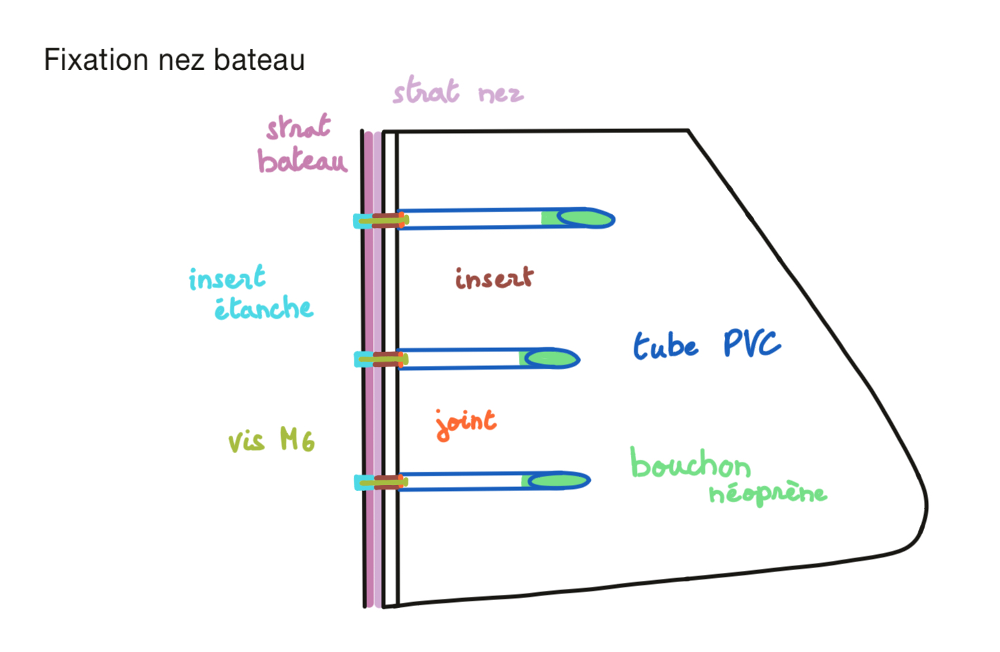
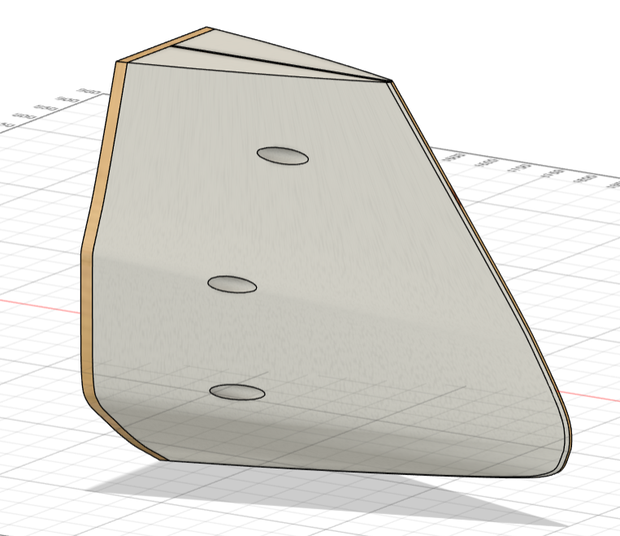

# Coque

## Dimensions
- **Longueur** : 4680 mm  
- **Hauteur** : 581 mm  
- **Largeur** : 692 mm 

## Étape de construction
La construction de la coque repose sur 4 parties principales :  
1. **Squelette** : réalisé en contreplaqué marine de 5 mm.  
2. **Armature** : constituée de chevrons.  
3. **Forme de la coque** : fabriquée en polystyrène.  
4. **Nez démontable** : pièce amovible fixée à l’avant sur l’armature.

## Assemblage
- **Squelette** : assemblage façon puzzle.  
- **Armature** : fixée avec des vis.  
- **Forme de la coque** : collée pour un maintien optimal (colle à bois).  
- **Nez démontable** : se fixe directement sur l’armature avant du bateau (système de fixation développé plus bas).

### Squelette


<!-- Comprends pas ce que veut dire la phrase dessous. Les traverses on en parle pas ? Et les dessus/dessous ? -->


Le squelette comporte des encoches spécifiques sur chaque couple pour s’assembler correctement :

- Couple 2 : **102.5 mm**  
- Couple 3 : **145 mm**  
- Couple 4 : **155 mm**  
- Couple 5 : **160 mm**  
- Couple 6 : **160 mm**  
- Couple 7 : **150 mm**  
- Couple 8 : **140 mm**  


### Armature

L’armature se compose de chevrons de deux tailles distinctes :  
- **Chevron supérieur** : 50x75 mm, traité en classe 2.  
- **Chevron inférieur** : 38x63 mm ou 38x60 mm (dimensions approximatives).  

Ces chevrons traversent toute la longueur du bateau, de l’avant à l’arrière. Sur eux sont fixés :  
- **Hauteurs** : renforts verticaux.  
- **Traverses** : renforts horizontaux.  

À l’avant, un système spécifique permet de fixer le nez démontable du Zéphyr. (Cf [Page coque](#nez))


### Forme de la coque

La **forme de la coque** est créée grâce à des blocs de polystyrènes façonné par un partenaire (iXblue), ça donne la forme de la coque à la coque. Plus simple d'avoir un support pour faire la stratification.

### Nez

Le **nez** du navire sera fixé à l’aide de vis M6. L’étanchéité sera assurée par l’utilisation d’inserts et de joints, tout en conservant la possibilité de démonter le nez pour faciliter la sortie du navire du local. Des perçages ont été réalisés dans le polystyrène pour y insérer des tubes en PVC, lesquels seront intégrés à la stratification. Afin de garantir l’étanchéité, ces tubes seront obturés à l’aide de bouchons en néoprène.





<!-- --------------------------------------------------------------------------------------------------------------------------------------------------- -->

## Organisation interne
La coque est divisée en 5 compartiments vides, appelés *boites*, numérotées de **1** à **5**, chacune ayant une fonction spécifique :


| **Boite** | **Section** | **Description** |
|-----------|-------------|------------------|
| 1         | 3           | Matériel informatique et communication (ordinateur de bord)|
| 2         | 4           | Voile N°1 et batteries principales |
| 3         | 5           | Puits de dérive, contrôleur de charge et gestionnaire intelligent de la batterie |
| 4         | 6           | Voile N°2 et éventuellement des batteries (à confirmer) |
| 5         | 8           | Gouvernail et éventuellement des batteries (à confirmer) (aux dernières nouvelles elles sont avec les voiles) |

### Étanchéité et connectiques
- La **boite N°1** est entièrement étanche et isolée des autres. Une boîte d’acquisition devra être conçue sur mesure pour gérer les connectiques et l’alimentation de ses composants.
- Les **boites N°2 à N°5** seront étanches uniquement à leur base. Elles sont reliées par des câbles d’alimentation électrique et d’information pour assurer le fonctionnement coordonné de tous les systèmes.  
  *(Pour plus de détails, voir [Page Électricité](../ArchitectureSysteme/Electricite))*

- Entre les **boîtes N°4 et N°5**, nous aurons la **baie de capteurs**.


### Description plus précise de l'organisation des boites

#### Boite N°1

Dans cette boîte, vous trouverez tous les équipements listés [ici](Equipement#liste-des-équipements-présents-dans-le-zéphyr) :

- **LattePanda Alpha**
  - Ordinateur de bord du Zéphyr
- **Jetson Nano**
  - Carte graphique du Zéphyr
- **MileSight UR35**
  - Modem WiFi et 4G avec GPS intégré
- **AIS Modem**
  - Permet de détecter l'activité des bateaux aux alentours s'ils en sont équipés. Les grands bateaux sont obligés de diffuser sur l'AIS ([Source](https://www.voileetmoteur.com/voiliers/equipement/lais-en-10-questions/112158))
- **Accéléromètre**
- **Boussole magnétique**

##### Plateforme suspendue
Une station suspendue sur amortisseurs, conçue pour servir de plateforme anti-choc, devra être développée pour maintenir les composants électroniques du bateau dans cette boîte.

```note
*Concevoir une plateforme entièrement suspendue est inutile. Les mouvements de rotation n'ont pas besoin d'être amortis, car cela augmenterait inutilement la complexité du système. Les PC peuvent fonctionner sans problème même inclinés, à condition qu'ils soient correctement ventilés.*  
*Le cahier des charges de la plateforme sera donc centré sur l'absorption des chocs provoqués par les impacts du bateau sur l'eau. Les amortisseurs devront être dimensionnés en fonction des chocs auxquels le Zéphyr pourrait être soumis.*
```

#### Boite N°2
Voici la liste des équipements présents dans la **Boite N°2** :

- **Système de maintien de la voile N°1**
- **Réducteur du mât** (Cf [Page voile](../Voiles/Voile#système-de-commande))
- **Moteur du mât** (Cf [Page équipement](../ArchitectureSysteme/Equipement#liste-des-équipements-présents-dans-le-zéphyr))
- **Batterie principale** (Cf [Page équipement](../ArchitectureSysteme/Equipement#liste-des-équipements-présents-dans-le-zéphyr))
- **Passage des câbles d'alimentation** (Cf [Page électricité](../ArchitectureSysteme/Electricite))
- **Passage des câbles d'information** (Cf [Page électricité](../ArchitectureSysteme/Electricite))
- **Capteur de température**
- **Capteur hygrométrique**

#### Boite N°3

- **Puits de dérive** (Cf [Page coque](Coque#Dérive))
- **Système de fixation de la dérive** (Cf [Page coque](Coque#Dérive))
- **Contrôleur de charge des batteries** (Cf [Page équipement](../ArchitectureSysteme/Equipement#liste-des-équipements-présents-dans-le-zéphyr))
- **Passage des câbles d'information** (Cf [Page électricité](../ArchitectureSysteme/Electricite))
- **Capteur de température**
- **Capteur hygrométrique**

Dans cette boîte, les équipements sont montés sur des glissières qui permettent de les relever à l'aide d'une poignée. Ces glissières sont fixées sur les deux lambourdes situées sur les côtés de la boîte. Les câbles des équipements doivent être suffisamment longs pour éviter toute tension lorsqu'ils sont relevés. [Type de glissières envisagé](https://www.leroymerlin.fr/produits/quincaillerie/quincaillerie-du-meuble/compas-verin-coulisseau-coulisse/lot-de-2-coulisses-pour-tiroir-a-billes-hettich-45-kg-l-25-cm-70206941.html)
```warning
La distance entre le puits de dérive et le bord de la boîte étant restreinte, il est essentiel de concevoir un système aussi compact que possible.
```

```warning
Étudier la fixation des câbles sur le contrôleur de charge. Ils pourraient être orientés vers le puits de dérive. Envisager l'achat de coudes pour garantir des connexions plus fiables.
```


#### Boite N°4

- **Système de maintien de la voile N°2**
- **Réducteur du mât** (Cf [Page voile](../Voiles/Voile#système-de-commande))
- **Moteur du mât** (Cf [Page équipement](../ArchitectureSysteme/Equipement#liste-des-équipements-présents-dans-le-zéphyr))
- **Batterie principale** (Cf [Page équipement](../ArchitectureSysteme/Equipement#liste-des-équipements-présents-dans-le-zéphyr))
- **Passage des câbles d'alimentation** (Cf [Page électricité](../ArchitectureSysteme/Electricite))
- **Passage des câbles d'information** (Cf [Page électricité](../ArchitectureSysteme/Electricite))
- **Capteur de température**
- **Capteur hygrométrique**


#### Boite N°5
-
-
- **Capteur de température**
- **Capteur hygrométrique**

<!-- --------------------------------------------------------------------------------------------------------------------------------------------------- -->


