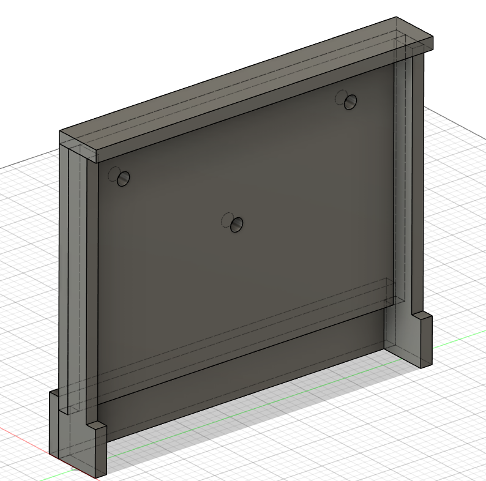
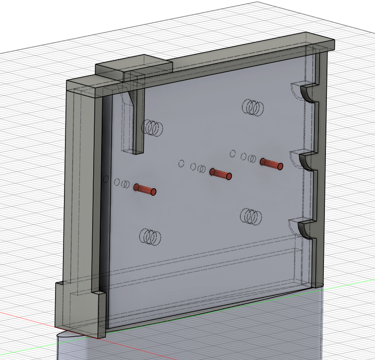

# Dérive

La **dérive** se logera dans un puits de dérive et sera statique. Elle sera fixée par **3 vis** (*M16 pour le moment*) de manière à ce que chaque vis supporte un effort et que les moments induits par l'eau sur la dérive soient annulés efficacement. Les trois vis sont situées au-dessus de la ligne de flottaison, pour un poids total de la coque de **540 kg**.

Les dimensions de la dérive sont fournies par les plans suivants (Conception 3D sur Fusion360 : "*Derive/DeriveZephyr*") :


## Puits de dérive

Pour calculer les dimensions du **puits de dérive**, une marge de **2 mm** de chaque côté a été ajoutée pour garantir l'étanchéité avec le raccord de stratification, ainsi qu'une **marge supplémentaire de 1 cm** pour faciliter le positionnement de la dérive. Cela donne une longueur intérieure de **410 mm**.

Pour assurer une structure robuste, tout le puits de dérive sera fabriqué en **contreplaqué marine okoumé de 15 mm d'épaisseur**. La construction se fait de la manière suivante : on colle et visse les deux parties *left side bottom* à la *left side* (de même pour les pièces "*right side bottom*" et "*right side*"), puis on assemble les parties *front* et *back* sur les parties *left side* et *right side* assemblées (voir schémas ci-dessous). La partie *top* se visse avec un joint en néoprène. **Les vis sont à placer sur la conception.**




## Montage

La solution envisagée pour monter la dérive (24/02/2024) consiste à **lever le bateau** à l'aide de poulies directement sur la remorque. Une fois le bateau levé, la dérive est glissée dans le puits, puis vissée en veillant à ce que les joints soient correctement positionnés pour assurer l'étanchéité des points de fixation. Ce montage nécessitera la présence d'au moins **2 personnes**.

Afin de faciliter cette opération, il est proposé d'ajouter des **aimants** dans le puits de dérive et dans la dérive elle-même pour guider celle-ci pendant l'installation.

```note
*Les solutions écartées incluent l'option de mettre la dérive en place une fois le bateau dans l'eau à l'aide d'un plongeur. Cette méthode présente des risques pour le plongeur, car le bateau pèsera au minimum 600 kg une fois tous les composants et lests installés. De plus, il serait difficile de contrôler le bateau au moment de l'installation. Une autre solution, déjà envisagée, consiste à ajouter un système de clips (cf. image ci-dessous ou conception 3D sur Fusion360 : Derive/Derive auto-lock), mais cela serait bien plus compliqué à mettre en œuvre.*
```

  
*Les parties rouges sur le plan sont des goupilles (optionnelles). La dérive tient en place grâce à des encoches et une barre de retenue. Pour faciliter le montage, des aimants ont été intégrés dans le puits de dérive et dans la dérive.*

