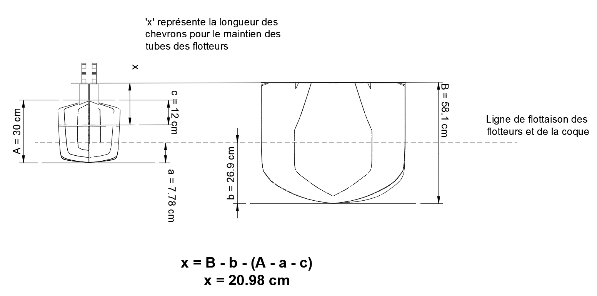
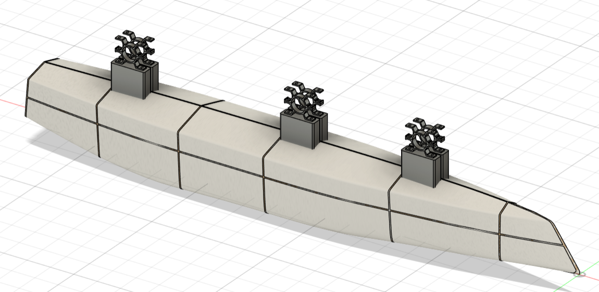
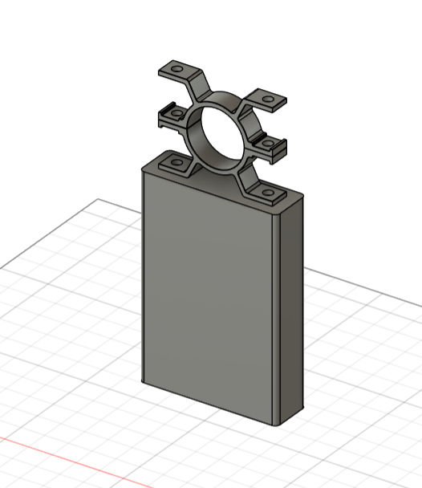

# Flotteur

Le **Zéphyr** étant un trimaran, il se compose d'une **coque principale** et de **2 flotteurs**. Les flotteurs sont construits de la même manière que la coque, avec un squelette en contreplaqué et une forme en polystyrène.

### Dimensions et Caractéristiques des Flotteurs
- **Dimensions** : 2325 mm (longueur) x 300 mm (largeur) x 300 mm (hauteur) (ou hauteur avec brides : 480 mm)
- **Volume total** : 0.127 m^3
- **Densité** : ___
- **Force d'Archimède associée** : 247.3 N

Hauteur des chevrons pour les fixation des tubes en aluminium aux flotteurs :  

Le modèle 3D des flotteurs est donné ci-dessous :

### Fixation des Flotteurs à la Coque
Les flotteurs seront accrochés à la coque principale par **3 tubes en aluminium** d'un diamètre extérieur de **60 mm** et d'une épaisseur de **5 mm**.

Des **brides de fixation** seront installées sur des **bastaings** fixés au squelette en contreplaqué des flotteurs. Voir schéma ci-dessous :

Un guide a été conçu afin de percer les bastaings avec un écartement précis. Ce guide permet de positionner les inserts de manière à aligner correctement les brides, assurant ainsi un placement optimal des tubes.

### Points d'Accroche et Utilisation
Les brides de fixation des flotteurs permettront d’accrocher divers équipements. Ces points d’accroche sont conçus pour être robustes et fiables. À ce jour, ces points serviront principalement à installer des **lampes** pour signaler la présence des flotteurs. Ils pourront également être utilisés pour fixer des **capteurs** ou tout autre équipement nécessaire.

