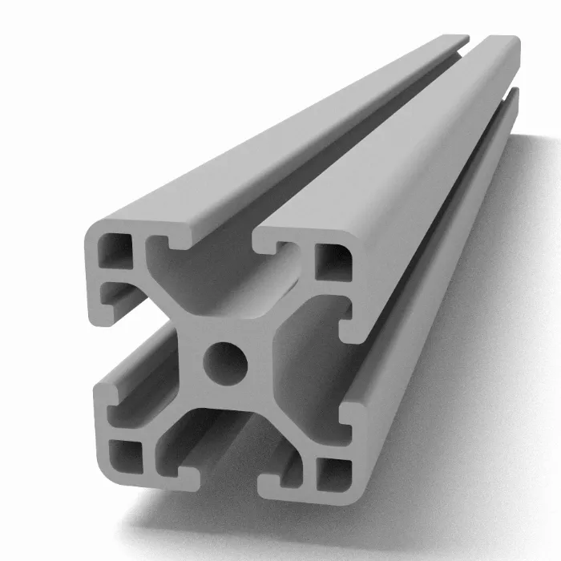

# Mâts

Les mâts sont en aluminium. Ils présentent les caractéristiques suivantes :

- **Diamètre extérieur :** 60 mm
- **Diamètre intérieur :** 50 mm (épaisseur : 5 mm)
- **Longueur :** 3 m

Ces mâts ont été sélectionnés à la suite d’une étude statique réalisée par Yohan Stablo, disponible dans son rapport de stage de première année. Ils sont dimensionnés pour résister aux efforts du vent quelles que soient les conditions météorologiques. 

## Support de mât

Les supports de mât sont des pièces critiques qui doivent transmettre les efforts subis par la voile à la colonne vertébrale du Zéphyr, permettant ainsi son déplacement. Cette pièce sert également à annuler les efforts transversaux au niveau du système de commande, ce qui réduit la fatigue et augmente la durabilité de ce dernier.

### Première solution écartée

Nos besoins exigeant une précision millimétrique, notre première solution qui était d'utiliser le même matériau que pour le bateau, à savoir des chevrons en bois à été écartée. En effet, la précision posait problème : les chevrons utilisés jusqu'à présent ne sont pas normalisés et présentent de grandes variations de dimensions par rapport à celles annoncées. Par exemple, des chevrons vendus pour 63x38 mm peuvent en réalité mesurer jusqu'à 55 mm de large, et la hauteur annoncée de 38 mm varie entre 35 mm et 40 mm. Les chevrons ne constituent donc pas une solution satisfaisante pour garantir la précision requise. De plus, les coupes réalisées à la scie circulaire présentent une tolérance de 1 à 2 mm autour de la coupe prévue.

Nous avons donc décidé de modifier le système initialement prévu, en adoptant la solution présentée ci-dessous.

### Solution gardée

Le nouveau système est composé de profilés en aluminium de référence : `Profilé aluminium 30x30L Type I rainure 6`. Les profilés sont coupés sur mesure par notre fournisseur, ce qui évite toute erreur de coupe de notre part.

Les profilés en aluminium sont fixés à l'aide d'équerres d'assemblage et de boulons M6, non représentés sur le plan 3D.

Une vue 3D du système suit :

Les blocs de bois sont des blocs de contreplaqué marine de 30 mm qui seront usinés pour accueillir les roulements coniques, lesquels servent à annuler les moments du mât dus au vent. Ces blocs sont percés de part en part. Une tige en acier fera office de goupille et maintiendra les blocs en place. Le bloc de bois inférieur est également usiné dans du contreplaqué 30mm et sert à recevoir le mât sur une butée à billes.

Le système de commande s’insère dans la cage inférieure et se fixe aux profilés en aluminium à l’aide de boulons, comme illustré sur la vue suivante.

#### Caractéristiques

- Le poids linéaire des profilés en aluminium est de 0.91 kg.m-1.
- La longueur totale de profilés en aluminium par système est de 5.6 m.
- Le poids total des profilés en aluminium est de 5.096 kg.

#### Montage mât

Le montage du mât s’effectue selon les étapes suivantes :

1. **Préparation** :  
	Monter le joint spi, le circlips supérieur et l’intérieur du roulement conique supérieur sur le mât avant de l’insérer dans le support.

2. **Insertion** :  
	Placer la cale, autour de laquelle est déjà positionné l'engrenage du mât, le circlips et l’intérieur du second roulement conique dans l'ordre de bas en haut. Insérer le mât à l’envers (volet vers l’avant) pour faciliter la pose de l’engrenage dans les fentes prévues dans les blocs de bois sur la cale.

3. **Assemblage** :  
	Faire coulisser les pièces à leur emplacement. Le montage du circlips peut être délicat.

4. **Fixation de l’engrenage** :  
	Goupiller l’engrenage pour le maintenir en place.

5. **Finalisation** :  
	Une fois l’engrenage goupillé, retirer la cale et faire pivoter le mât pour avoir le volet vers l'arrière, puis glisser et fixer le système de commande.
