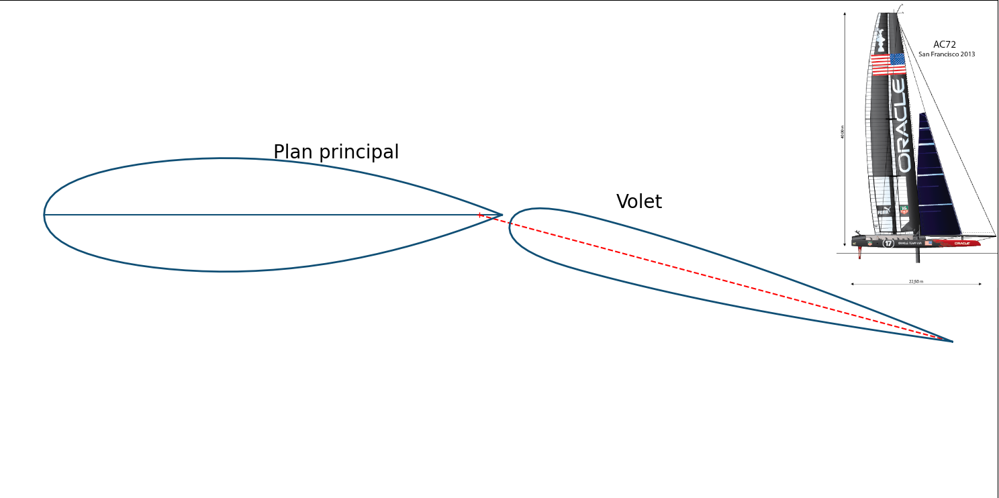
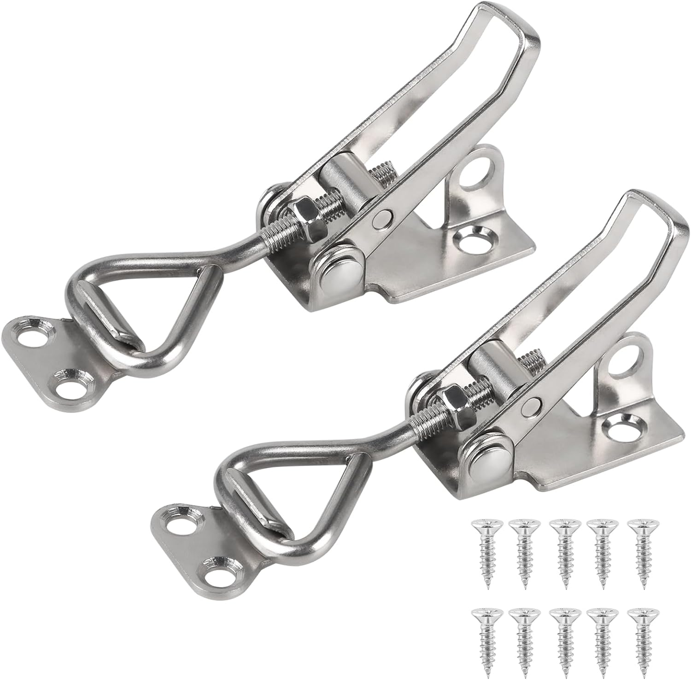

# Voiles
Le Zéphyr étant mu seulement par la propulsion vélique, ses deux voiles en sont un élément important.  
Chacune de ses voiles sont des ***wingsails***, c'est-à-dire des ***voiles rigides***.  
Pour être plus précis, les *wingsails* sont des voiles empruntées aux navires de courses, qui se composent d'un **plan principal** et d'un **volet**, et dont le principe est identique à celui des ailes d'avions : créer de la "*portance*" grâce au vent vitesse.  
Le profil d'aile prévue pour les voiles est le même que celui des [**AC-72**](https://en.wikipedia.org/wiki/AC72) :  

Le tissu ripstop a été retenu pour la fabrication des voiles, en raison de son tissage spécifique qui limite la propagation des déchirures. Les couleurs des voiles ont été définies en fonction de critères de visibilité : les voiles principales sont blanches afin d'assurer une bonne visibilité de nuit, tandis que les volets sont orange pour être facilement repérables de jour. Ce choix de couleurs vise également à éviter toute confusion avec le balisage maritime, le orange n'étant pas utilisé dans ce contexte.

## Plan principal

La voile est composée de plusieurs gabarits qui vont donner la forme à la voile, et de bloc support (1 en haut et 1 en bas), ces derniers seront visser directement sur les mâts.  
Sur le bloc support du haut, on retrouve le système de maintien du volet et des point de fixation pour des câbles. Ces câbles seront tendus du bloc d'en haut au bloc d'en bas afin d'assurer la forme du bord d'attaque du tissu face au vent.

Pour tendre les voiles, l'idée qui semble la plus convaincante (Fabien) est d'utiliser des loquets à bascule de ce type-là. La vis permettra de régler la tension sur la voile de manière plutôt précise (1 demi-tour de vis). Ces loquets sont en Inox avec une capacité de maintien de 100 kg. [lien](https://www.amazon.fr/EXLECO-Capacit%C3%A9-R%C3%A9tention-Sauterelles-R%C3%A9glable/dp/B09P863CTS?th=1). L'avantage principale de ce loquet est que l'on peut le cadenasser et empêché que la voile se détende avec les vibrations.

Pour gagner du poids sur la voile, les gabarits sont évidés à plusieurs endroits, **une étude mécanique doit valider leur résistance**.
Ajouter une vis sur les maintiens de voile principal de 40 mm en haut, pas besoin en bas.

Passer une corde dans le tube de maintien de position des gabarits sur le plan principal pour équilibrer les forces des fils de forme du bord d'attaque.

Pour étanchéifier les blocs support du haut et du bas : [lien verni marin](https://www.amazon.fr/Vernis-marin-Protection-Excellente-r%C3%A9sistance/dp/B08XQR2Q78?th=1).

## Système de commande plan principal

# Volet
Le profil utilisé est un NACA 0012.

## Système de commande volet

# Baume